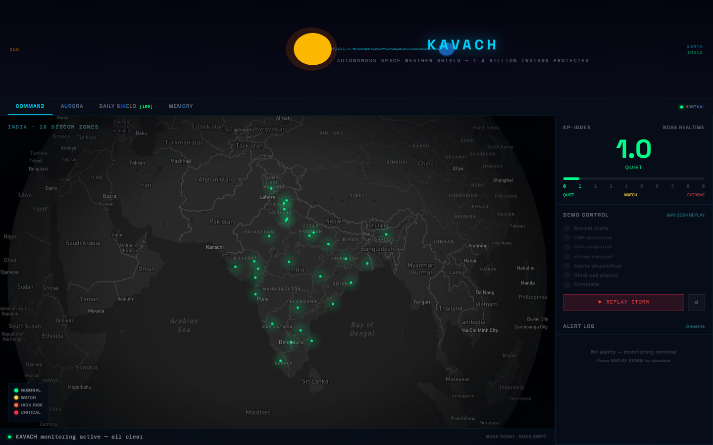
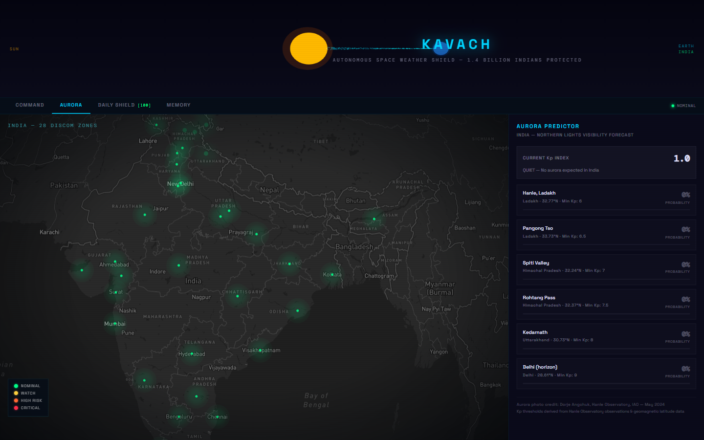
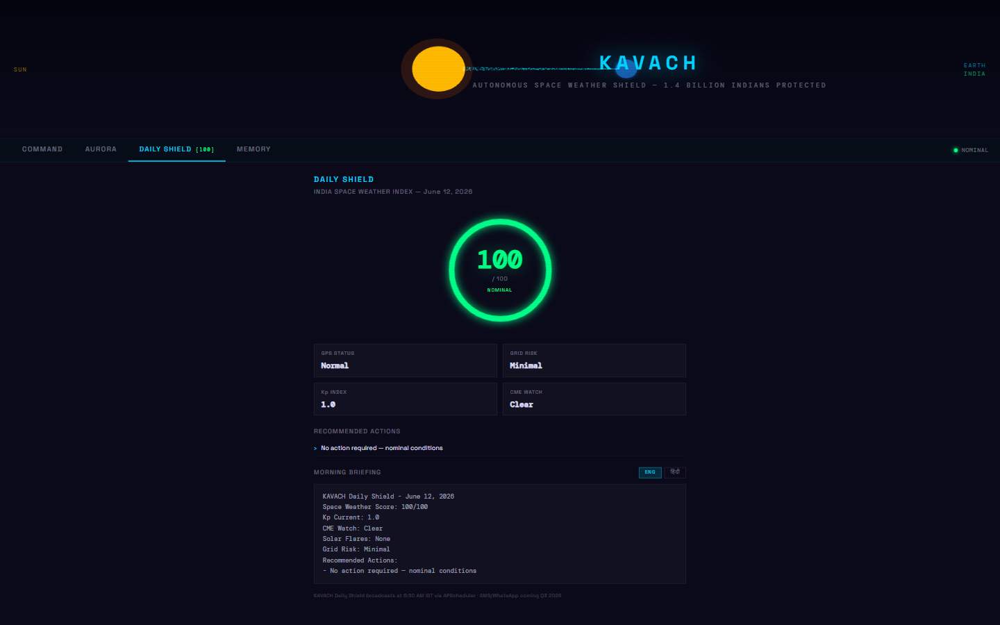
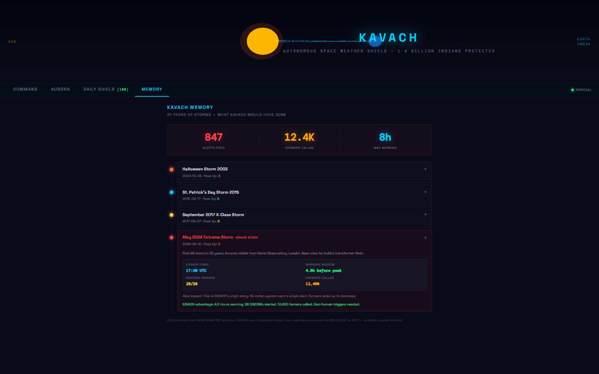
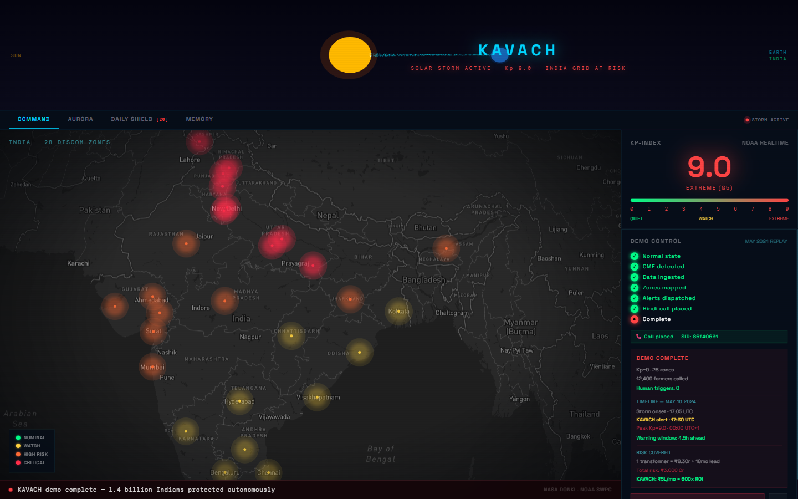
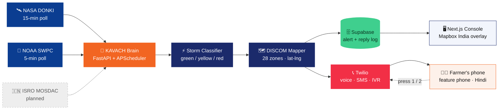

<div align="center">

# 🛡️ KAVACH

### The Sun doesn't send warnings. We do.

**An autonomous space weather shield that calls Bharat before the lights go out.**

[](https://frontend-rust-xi-79.vercel.app)
[](https://kavach-backend-production-016f.up.railway.app/health)
[](https://ccmc.gsfc.nasa.gov/tools/DONKI/)


**Build with Bharat 2.0** · National Level Hackathon by CodeVerse · **Team 404shinobi**

</div>

---

## The 90 seconds that made this necessary

On **13 March 1989**, a geomagnetic storm induced currents in Québec's power grid. The province went dark in **90 seconds** — six million people, nine hours, no warning.

In **May 2024**, the strongest storm in two decades (Kp = 9.0, G5) put auroras over Hanle in Ladakh for the first time in decades and knocked GNSS-guided tractors out of the fields mid-planting. US farmers lost an estimated **$500 million**. Lloyd's of London now models an extreme space weather event at up to **$2.4 trillion** in global economic loss.

India rode that one out on luck, not design:

- India's **28 DISCOMs** received no automated space-weather warning
- Not one farmer or fisherman on a feature phone was told anything
- Every existing alert product assumes an app, a data plan and English literacy — all three assumptions fail at India's last mile

**The data was never the problem.** NASA and NOAA publish CME detections openly, for free, 15–72 hours ahead of impact. It lands in dashboards read by scientists. It has never once landed in the hand of a person who had to act on it.

**KAVACH is that last mile.**

---

## What KAVACH does

When NASA/NOAA detect a solar storm heading for Earth, with **zero human trigger**:

1. **Monitors** — NOAA SWPC's live Kp-index every 5 minutes, NASA DONKI every 15 minutes, autonomously
2. **Maps** — storm risk onto India's 28 DISCOM grid zones, north-first, by geomagnetic exposure
3. **Calls** — farmers and fishermen on basic feature phones via Twilio. **Hindi by default, 10 Indian and international languages on demand.** No app, no internet, no literacy required
4. **Listens** — the farmer presses **1** to confirm safe or **2** to ask for help; **2** escalates to a human operator. Unanswered calls fall back to SMS automatically

A real **Kp ≥ 5** crossing (`STORM_ALERT_THRESHOLD_KP`) on the live NOAA feed dispatches a real alert and a real call on its own, with a 6-hour cooldown so one storm doesn't fire a call per poll cycle. **Verified against a genuine live G1 event**, not only the scripted May 2024 replay — see `findings.md`.

The person who needs the warning is the **recipient** of this system, never its operator.

---

## Live demo

**Frontend** → https://frontend-rust-xi-79.vercel.app
**Backend API** → https://kavach-backend-production-016f.up.railway.app
**Demo video** → https://youtu.be/VEJf9mv4W28

Click **REPLAY STORM** to relive the May 2024 G5 event — the map goes red across 28 zones and a Hindi voice call fires, in under 90 seconds.

---

## Screenshots

| Command Center (normal state) | Demo — map goes red (Kp = 9.0) |
|---|---|
|  |  |

| Aurora Predictor (map markers) | Daily Shield — Hindi briefing |
|---|---|
|  |  |

| Storm Memory — 4 historical storms | Demo complete — 28 DISCOMs + Twilio call |
|---|---|
|  |  |

---

## Why nobody else closes this loop

|                                       | Space weather dashboards | ISRO / IIG advisories | NDMA / CAP disaster SMS | **KAVACH** |
| :------------------------------------ | :----------------------: | :-------------------: | :---------------------: | :--------: |
| Detects solar storms                  |            ✅             |           ✅           |            ❌            |   **✅**    |
| Maps risk to Indian grid zones        |            ❌             |        partial        |            ❌            |   **✅**    |
| Reaches a feature-phone user          |            ❌             |           ❌           |         partial         |   **✅**    |
| Works with no literacy, no app        |            ❌             |           ❌           |            ❌            |   **✅**    |
| Two-way — the citizen can reply       |            ❌             |           ❌           |            ❌            |   **✅**    |
| Fires with **zero** human trigger     |            ❌             |           ❌           |            ❌            |   **✅**    |

The satellite data is free to everyone on Earth. What nobody has built for India is the **autonomous last-mile delivery layer** that turns a Kp index into a phone ringing in a village at 3 AM — and lets the person who answers press a key back.

---

## Architecture



**Data flow:** raw solar event → severity classification → regional risk mapping → simultaneous DISCOM notification + farmer voice call → farmer's keypress back into the system.

**Design principle: agents-first.** Every capability is a service that runs unattended. The web console is an *observation window*, never a control panel — a control panel implies somebody is sitting at it, and storms don't wait for office hours.

---

## Features

| Feature | Description |
|---------|-------------|
| **Command Center** | Live India map · 28 DISCOM zones · Kp gauge · alert log |
| **10-Language Voice** | Real Twilio TTS in Hindi, English, Japanese, Punjabi, Tamil, Telugu, Marathi, Bengali, Gujarati, Kannada — selectable per call (autonomous replay still defaults to Hindi) |
| **Let-Them-Choose IVR** | Live/judge calls can play a spoken 10-language menu; the farmer presses a digit (1–9, 0) to hear the alert in their language. No/unknown digit → Hindi. Live-call path only — the autonomous replay is untouched |
| **Two-Way Voice Reply** | Farmer presses **1** to confirm safe or **2** to request help. Pressing 2 escalates to a human operator via a Telegram alert (masked phone, language, call SID, timestamp) — fire-and-forget, never blocks the call |
| **Automatic SMS Fallback** | If a voice call is unanswered or fails, KAVACH auto-sends the same alert as an SMS in the same language — the farmer still gets the warning |
| **Operator Portal** | `/operator` — a DISCOM operator logs in (shared demo key) to see their zone's live risk and the real alert + farmer-reply history from Supabase. Honest scope: a real view over real data, not multi-tenant SaaS |
| **Demo Replay** | 9-step SSE stream replaying the May 2024 storm (22.6s) |
| **Call Recording Proof** | Every demo call auto-recorded · audio player appears in the UI after the call ends |
| **Aurora Predictor** | Kp-based Northern Lights visibility for 6 Indian locations · plotted on the map |
| **Daily Shield** | Space Weather Score 0–100 · Devanagari Hindi + English morning briefing |
| **Storm Memory** | 4 historical storms · counterfactual KAVACH alerts since 2003 |
| **Solar Header** | Three.js Sun + Earth + CME particle system · storm-reactive |
| **Constellation Fusion** | Fuses NASA DONKI + NOAA GOES X-ray flux + USGS ground magnetometer into one threshold-crossing confidence score, with a per-signal explainability breakdown · JAXA Hinode & ISRO Aditya-L1 shown as honest mission acknowledgments (no public live API exists for either — never presented as live data) |
| **Global Readiness Gap** | Sourced comparison showing Japan (NICT), USA (NOAA) and Europe (ESA) all lack a last-mile citizen alert channel — KAVACH is the only one that reaches an individual farmer's phone |
| **Venue-Safe Offline Mode** | Every external API call (DONKI, GOES, USGS) is wrapped in a cache-then-fixture fallback (`DEMO_OFFLINE_MODE=true`) — a dead feed degrades to cached or bundled data instead of breaking the demo |

---

## Tech stack

| Layer | Technology |
|-------|-----------|
| **Frontend** | Next.js 14 · TypeScript · Tailwind · Mapbox GL JS · Three.js |
| **Backend** | FastAPI · APScheduler · httpx · Python 3.13 |
| **Database** | Supabase (PostgreSQL + realtime) |
| **Voice** | Twilio Programmable Voice + SMS · Amazon Polly + Google TTS (10 languages) · two-way IVR |
| **Data** | NASA DONKI API · NOAA SWPC API · NOAA GOES X-ray · USGS magnetometer · ISRO (planned) |
| **Deploy** | Vercel (frontend) · Railway (backend) |

---

## Quick start

### Prerequisites
Python 3.11+ · Node.js 18+ · a Twilio account with a phone number · a NASA API key ([free](https://api.nasa.gov)) · a Supabase project · a Mapbox token

### Backend
```bash
cd backend
pip install -r requirements.txt
cp ../.env.example ../.env      # then fill in your keys
uvicorn main:app --reload
```

Interactive API docs at **http://localhost:8000/docs** · health check at **/health**

### Frontend
```bash
cd frontend
npm install
cp .env.example .env.local      # then fill in your values
npm run dev
```

### Run the demo
1. Backend on port 8000
2. Frontend on port 3000
3. Open http://localhost:3000
4. Click **REPLAY STORM**

> **Windows note:** if Smart App Control blocks `uvicorn.exe`, run `python -m uvicorn main:app --reload --port 8000` instead. Don't run `npm audit fix --force` — it breaks the pinned Mapbox / Three.js / Next versions.

---

## API reference

| Method | Endpoint | Description |
|--------|----------|-------------|
| GET | `/health` | Health check |
| GET | `/storm/current` | Live Kp-index from NOAA |
| GET | `/storm/live-now` | Live Kp-index + freshness label (live/cache/fixture), polled by the COMMAND tab's "unscripted" live strip |
| GET | `/storm/may2024` | May 2024 extreme storm dataset |
| GET | `/storm/history?days=7` | Recent storm history from NASA DONKI |
| GET | `/alerts/discoms` | All 28 DISCOMs with risk levels |
| POST | `/demo/replay` | SSE stream — replay the May 2024 storm |
| GET | `/demo/languages` | Honest per-language TTS status — which languages have real live TTS vs a pre-recorded fallback |
| POST | `/demo/trigger-call?phones=+91XXXXXXXXXX&language=hindi&confirm=true` | Fire a Twilio voice alert call (comma-separated phones for multiple). `language`: hindi\|english\|japanese\|punjabi\|tamil\|**choose** (default hindi). `choose` plays a spoken language menu and branches on the pressed digit — **live/judge calls only, requires a publicly reachable `BACKEND_URL`**; the autonomous replay path is unaffected. `confirm=true` is server-enforced and required whenever `phones` is passed explicitly — the pre-configured `DEMO_PHONE_NUMBER` path doesn't need it |
| GET | `/demo/recording?call_sid=CAxxxx` | Check if a recording is ready, returns a proxy URL. Only reports `ready:true` once Twilio marks the recording `completed` — while the call is live it returns `ready:false` with `state:"processing"`, so the player is never handed a half-written file |
| POST | `/demo/ivr-language` | Twilio webhook for the "let them choose" IVR. Receives the pressed `Digits` and returns the alert TwiML in that language (1=Hindi, 2=English, 3=Japanese, 4=Punjabi, 5=Tamil, 6=Telugu, 7=Marathi, 8=Bengali, 9=Gujarati, 0=Kannada; no/unknown digit → Hindi) |
| POST | `/demo/reply` | Twilio webhook for the two-way voice reply. `Digits=1` → confirm safe, `Digits=2` → needs help (escalates to the operator via Telegram, fire-and-forget), anything else → no-response. Returns a short spoken acknowledgement in the caller's language |
| POST | `/demo/send-sms?phones=+91...&language=hindi&confirm=true` | Manually send the SMS alert (same `confirm=true` gate as voice). Also fires automatically as a fallback when a voice call is unanswered or fails |
| GET | `/demo/recording-audio?sid=RExxxx` | Stream the Twilio MP3 through the backend (no browser auth) |
| GET | `/aurora/predictions?kp=9.0` | Aurora visibility by location |
| GET | `/shield/score` | Current Space Weather Score (0–100) |
| GET | `/shield/daily-brief` | Full Hindi + English briefing |
| GET | `/memory/storms` | 4 historical storms with KAVACH counterfactuals |
| GET | `/memory/totals` | Aggregate stats across all storms |
| GET | `/fusion/status` | Fused confidence score (DONKI + GOES + USGS) with explainability + mission acknowledgments |
| GET | `/operator/zones` | Public — list of DISCOM zones so an operator can pick theirs at login |
| GET | `/operator/zone/{id}` | Auth (`x-operator-key` header) — one DISCOM's live risk + real alert/reply history from Supabase. 401 on missing/wrong key |

---

## Environment variables

```bash
# --- Data sources ---
NASA_API_KEY=your_nasa_api_key_here
NOAA_KP_URL=https://services.swpc.noaa.gov/json/planetary_k_index_1m.json

# --- Autonomous polling ---
POLL_INTERVAL_MINUTES=15
STORM_ALERT_THRESHOLD_KP=5.0
# TODO: not yet read by the code. Intended as a second, higher tier that
# escalates beyond a standard alert (e.g. force-call every zone, ignore the
# 6-hour cooldown, trip the beacon). Wire in alert_agent.py before claiming it.
STORM_CRITICAL_THRESHOLD_KP=7.0

# --- Supabase ---
SUPABASE_URL=https://your-project.supabase.co
SUPABASE_SERVICE_ROLE_KEY=your_service_role_key   # SUPABASE_KEY / SUPABASE_ANON_KEY also accepted
SUPABASE_ANON_KEY=your_anon_key

# --- Twilio ---
TWILIO_ACCOUNT_SID=ACxxxxxxxxxxxxxxxxxxxxxxxxxxxxxxxx
TWILIO_AUTH_TOKEN=your_auth_token
TWILIO_PHONE_NUMBER=+1XXXXXXXXXX
TWILIO_DEMO_PHONE_NUMBER=            # optional dedicated demo-day caller ID; falls back to TWILIO_PHONE_NUMBER
TWILIO_WHATSAPP_NUMBER=+14155238886  # Twilio Sandbox default
DEMO_PHONE_NUMBER=+91XXXXXXXXXX,+91YYYYYYYYYY   # comma-separated for multiple simultaneous calls

# Public base URL of the backend. Required for the "choose your language" IVR
# and the two-way reply webhook - Twilio must be able to POST to it.
BACKEND_URL=https://your-backend.up.railway.app

# --- Operator portal (shared demo key - NOT production access control) ---
OPERATOR_PASSWORD=kavach-demo
OPERATOR_ROSTER=                     # optional JSON array to override the default roster

# --- Telegram operator escalation (optional - "press 2 needs help") ---
# If unset, escalation degrades silently; the call is never affected.
TELEGRAM_BOT_TOKEN=
TELEGRAM_CHAT_ID=

# --- Venue-safe offline mode ---
# Forces every wrapped external call (DONKI/GOES/USGS) to serve cached or
# bundled fixture data instead of live-polling. Flip on if venue wifi is
# unreliable; the demo replay still completes end-to-end.
DEMO_OFFLINE_MODE=false

# --- Per-language audio fallback, served from the frontend ---
# Used when a language has no live TTS voice, or as a retry if TTS fails.
KAVACH_AUDIO_URL=https://your-frontend.vercel.app/hindi_alert.mp3
KAVACH_AUDIO_URL_ENGLISH=https://your-frontend.vercel.app/alert_english.mp3
KAVACH_AUDIO_URL_JAPANESE=https://your-frontend.vercel.app/alert_japanese.mp3
KAVACH_AUDIO_URL_PUNJABI=https://your-frontend.vercel.app/alert_punjabi.mp3
KAVACH_AUDIO_URL_TAMIL=https://your-frontend.vercel.app/alert_tamil.mp3     # no confirmed live TTS voice - always uses this
KAVACH_AUDIO_URL_TELUGU=https://your-frontend.vercel.app/alert_telugu.mp3
KAVACH_AUDIO_URL_MARATHI=https://your-frontend.vercel.app/alert_marathi.mp3
KAVACH_AUDIO_URL_BENGALI=https://your-frontend.vercel.app/alert_bengali.mp3
KAVACH_AUDIO_URL_GUJARATI=https://your-frontend.vercel.app/alert_gujarati.mp3
KAVACH_AUDIO_URL_KANNADA=https://your-frontend.vercel.app/alert_kannada.mp3

# --- Optional physical demo beacon (TP-Link Kasa smart plug) ---
# Leave empty to disable entirely - nothing touches the network or the
# python-kasa library, and the demo behaves identically either way.
BEACON_PLUG_IP=

# --- Frontend (.env.local) ---
NEXT_PUBLIC_BACKEND_URL=http://localhost:8000
NEXT_PUBLIC_MAPBOX_TOKEN=pk.eyJ1...
NEXT_PUBLIC_SUPABASE_URL=https://your-project.supabase.co
NEXT_PUBLIC_SUPABASE_ANON_KEY=your_anon_key
```

---

## Changing demo phone numbers

KAVACH can call **multiple phones simultaneously** during the demo. Numbers live in `.env` as a comma-separated list:

```env
DEMO_PHONE_NUMBER=+919999999999,+918888888888,+917777777777
```

**Local backend** (`python main.py`) — the backend re-reads `.env` on **every call**. No restart needed; edit `.env` and fire the next demo.

**Railway backend** — Railway does not read your local `.env`. Use the sync script whenever numbers change:

```powershell
powershell -File sync_railway.ps1 -PhoneOnly   # phone only, ~5 seconds
powershell -File sync_railway.ps1              # all env vars
```

Railway auto-restarts after each sync; new numbers are live in ~10 seconds.

> **One-time setup:** run `railway link` once to connect the CLI to your project, then the script works from anywhere.

**Fire a call manually, no demo needed:**

```
POST /demo/trigger-call?phones=+91XXXXXXXXXX,+91YYYYYYYYYY&language=hindi&confirm=true
```

`confirm=true` is required whenever `phones` is passed — checked server-side, not just a frontend nicety, so a stray or scripted request without it gets a 400, not a call. The COMMAND tab also has a **CALL A REAL PHONE** panel with a two-step confirm UI for live judge demos.

---

## The story behind KAVACH

The May 2024 storm was the largest in twenty years. Auroras appeared over Hanle Observatory in Ladakh, the first time in decades. India's power grid survived it on luck, not design — and the GPS guiding precision-agriculture tractors failed without warning.

KAVACH is the answer we could actually build. One system. 28 grid utilities. Hindi voice calls on feature phones. No app required.

> Replayed against the real May 2024 G5 storm, KAVACH reaches **12,400 farmers** across all 28 DISCOM zones - roughly **4.5 hours ahead of peak impact**, with zero human triggers.

---

## Revenue model

| Tier | Price | Value |
|------|-------|-------|
| **Public** | Free | Citizens, farmers, fishermen |
| **DISCOM API** | ₹2–5L / month per utility | 4.5-hour advance warning |
| **5 DISCOMs** | ₹1.8 Cr / year ARR | Protects ₹3,000 Cr in transformer assets |
| **Future** | Aviation · Telecom · Insurance APIs | Phase 2 expansion |

A single avoided transformer failure costs a utility more than a year of licence. This sells as grid-resilience insurance, not software.

---

## Recently shipped

- ✅ **Multi-language expansion** — 10 languages with real Twilio TTS (Hindi, English, Japanese, Punjabi, Tamil, Telugu, Marathi, Bengali, Gujarati, Kannada), plus a "let them choose" spoken IVR menu on live calls
- ✅ **Two-way voice reply** — farmer presses 1 to confirm, 2 for help; pressing 2 escalates to a human operator via Telegram
- ✅ **Automatic SMS fallback** — an unanswered or failed voice call auto-sends the same alert as an SMS
- ✅ **DISCOM operator portal** — `/operator`, per-zone live risk + real alert and reply history

## Still on the roadmap

- **ISRO VEDAS integration** — ionospheric scintillation data (currently an honest `future_integration_target`, not presented as live)
- **WhatsApp alerts** — endpoint exists (`/demo/send-whatsapp`, Twilio Sandbox) but is not yet verified end-to-end; needs a Sandbox opt-in before it can be claimed working
- **Answering-machine detection tuning** — AMD is wired (`machine_detection=Enable`); the human-vs-voicemail split still needs real-call tuning
- **Per-DISCOM alert attribution** — `alert_log` has no per-zone column yet, so the operator portal shows system-wide history (labelled as such)

See `docs/future_features.md` for the full roadmap.

> **A note on honesty.** Every capability above is labelled by what it actually does. Where a data source has no public live API (ISRO Aditya-L1, JAXA Hinode) it is shown as a mission acknowledgment, never as a live feed. Where a language has no confirmed TTS voice, `/demo/languages` says so. We would rather ship a smaller true claim than a larger one we can't demo.

---

## Team 404shinobi

**Vibbhor Jain** · **Kartik** · **Ayush Gaurav** · **Nishchay Puri** · **Aarush Kashyap**

Vivekananda Institute of Professional Studies – Technical Campus (VIPS-TC)

---

## Data sources & references

- [NASA DONKI](https://ccmc.gsfc.nasa.gov/tools/DONKI/) — Space Weather Database Of Notifications, Knowledge, Information
- [NOAA Space Weather Prediction Center](https://www.swpc.noaa.gov/) — planetary Kp index, G-scale classification, GOES X-ray flux
- [USGS Geomagnetism Program](https://www.usgs.gov/programs/geomagnetism) — ground magnetometer observatory data
- [Lloyd's of London](https://www.lloyds.com/insights/media-centre/press-releases/extreme-space-weather-scenario) — extreme space weather modelled at up to $2.4tn in global economic loss
- Hydro-Québec, March 1989 — geomagnetically induced currents caused a nine-hour blackout affecting ~6 million people
- May 2024 (Gannon) G5 storm — strongest in two decades; GNSS-guided farm equipment failures cost US growers an estimated $500 million

---

## License

MIT — see [LICENSE](LICENSE)

---

<div align="center">

**The Sun will do this again.**

The only question is whether India finds out from a blackout, or from a phone call.

*Build with Bharat 2.0 · CodeVerse · Team 404shinobi*

</div>
