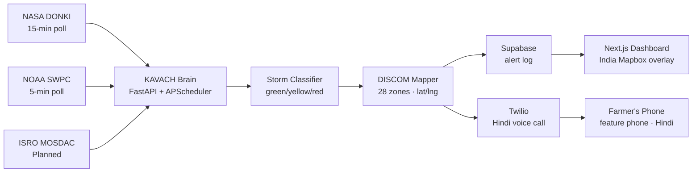

# KAVACH — Autonomous Space Weather Shield for India

> **"It called the farmer before the lights went out."**

[](https://fastapi.tiangolo.com)
[](https://nextjs.org)
[](https://twilio.com)
[](https://vercel.com)
[](LICENSE)

**FAR AWAY 2026 Hackathon** · Space & Aerospace · Team 404_SHINOBI

---

## The Problem

On May 10–11, 2024, the strongest geomagnetic storm in 20 years hit Earth (Kp=9.0, G5 level):

- India's 28 power grid utilities (DISCOMs) received **zero automated warning**
- 300 million farmers and fishermen relying on GPS got **no alert at all**
- English-only, internet-only Western alert systems are useless to India's last mile
- India came within hours of widespread transformer failures

**No Indian team had ever built a solution.** Until KAVACH.

---

## What KAVACH Does

When NASA/NOAA detects a solar storm heading toward Earth:

1. **Monitors** NOAA SWPC's live Kp-index every 5 minutes and NASA DONKI every 15 minutes, autonomously
2. **Maps** storm risk onto India's 28 DISCOM grid zones (north-first, by geomagnetic exposure)
3. **Calls** farmers and fishermen on basic feature phones via Twilio — **Hindi by default, 10 Indian languages on demand** — no app, no internet required
4. **Listens** — the farmer presses **1** to confirm safe or **2** to ask for help; pressing 2 escalates to a human operator. If the call goes unanswered, KAVACH falls back to SMS automatically

Zero human trigger. Fully autonomous — a real Kp≥5 (`STORM_ALERT_THRESHOLD_KP`) crossing on the live NOAA feed dispatches a real alert and call on its own, with a 6-hour cooldown so one storm doesn't cause a call per poll cycle. Verified against a genuine live G1 event, not just the scripted May 2024 replay below — see `findings.md`.

---

## Live Demo

**Frontend:** https://frontend-rust-xi-79.vercel.app  
**Backend API:** https://kavach-backend-production-016f.up.railway.app

Click **REPLAY STORM** to relive the May 2024 G5 event — map goes red, Hindi call fires, in under 90 seconds.

---

## Screenshots

| Command Center (normal state) | Demo — map goes red (Kp=9.0) |
|---|---|
|  |  |

| Aurora Predictor (map markers) | Daily Shield — Hindi briefing |
|---|---|
|  |  |

| Storm Memory — 4 historical storms | Demo complete — 28 DISCOMs + Twilio call |
|---|---|
|  |  |

---

## Architecture



**Data flow:** raw solar event → severity classification → regional risk mapping → simultaneous DISCOM notification + farmer voice call.

---

## Features

| Feature | Description |
|---------|-------------|
| **Command Center** | Live India map · 28 DISCOM zones · Kp gauge · alert log |
| **10-Language Voice** | Real Twilio TTS in Hindi, English, Japanese, Punjabi, Tamil, Telugu, Marathi, Bengali, Gujarati, Kannada — selectable per call (autonomous replay still defaults to Hindi) |
| **Let-Them-Choose IVR** | Live/judge calls can play a spoken 10-language menu; the farmer presses a digit (1–9, 0) to hear the alert in their language. No/unknown digit → Hindi. Live-call path only — the autonomous replay is untouched |
| **Two-Way Voice Reply** | Farmer presses **1** to confirm safe or **2** to request help. Pressing 2 escalates to a human operator via a Telegram alert (masked phone, language, call SID, timestamp) — fire-and-forget, never blocks the call |
| **Automatic SMS Fallback** | If a voice call is unanswered or fails, KAVACH auto-sends the same alert as an SMS in the same language — the farmer still gets the warning |
| **Operator Portal** | `/operator` — a DISCOM operator logs in (shared demo key) to see their zone's live risk and the real alert + farmer-reply history from Supabase. Honest scope: a real view over real data, not multi-tenant SaaS |
| **Demo Replay** | 9-step SSE stream replaying May 2024 storm (22.6s) |
| **Call Recording Proof** | Every demo call auto-recorded · audio player appears in UI after call ends |
| **Aurora Predictor** | Kp-based Northern Lights visibility for 6 Indian locations · plotted on map |
| **Daily Shield** | Space Weather Score 0–100 · Devanagari Hindi + English morning briefing |
| **Storm Memory** | 4 historical storms · counterfactual KAVACH alerts since 2003 |
| **Solar Header** | Three.js Sun+Earth+CME particle system · storm-reactive |
| **Constellation Fusion** | Fuses NASA DONKI + NOAA GOES X-ray flux + USGS ground magnetometer into one threshold-crossing confidence score, with a per-signal explainability breakdown · JAXA Hinode & ISRO Aditya-L1 shown as honest mission acknowledgments (no public live API exists for either — never presented as live data) |
| **Global Readiness Gap** | Sourced comparison showing Japan (NICT), USA (NOAA), and Europe (ESA) all lack a last-mile citizen alert channel — KAVACH is the only one that reaches an individual farmer's phone |
| **Venue-Safe Offline Mode** | Every new external API call (DONKI, GOES, USGS) is wrapped in a cache-then-fixture fallback (`DEMO_OFFLINE_MODE=true`) — a dead feed degrades to cached or bundled data instead of breaking the demo |

---

## Tech Stack

| Layer | Technology |
|-------|-----------|
| Frontend | Next.js 14 · TypeScript · Tailwind · Mapbox GL JS · Three.js |
| Backend | FastAPI · APScheduler · httpx · Python 3.13 |
| Database | Supabase (PostgreSQL + realtime) |
| Voice | Twilio Programmable Voice + SMS · Amazon Polly + Google TTS (10 languages) · two-way IVR |
| Data | NASA DONKI API · NOAA SWPC API · ISRO (planned) |
| Deploy | Vercel (frontend) · Railway (backend) |

---

## Quick Start

### Prerequisites
- Python 3.11+
- Node.js 18+
- Twilio account with a phone number
- NASA API key (free at https://api.nasa.gov)
- Supabase project
- Mapbox token

### Backend
```bash
cd backend
pip install -r requirements.txt
cp ../.env.example ../.env
# Edit .env with your keys
uvicorn main:app --reload
```

### Frontend
```bash
cd frontend
npm install
# Copy .env.example to .env.local and fill in values
npm run dev
```

### Run the Demo
1. Start backend on port 8000
2. Start frontend on port 3000
3. Open http://localhost:3000
4. Click **REPLAY STORM**

---

## API Reference

| Method | Endpoint | Description |
|--------|----------|-------------|
| GET | `/health` | Health check |
| GET | `/storm/current` | Live Kp-index from NOAA |
| GET | `/storm/live-now` | Live Kp-index + freshness label (live/cache/fixture), polled by the COMMAND tab's "unscripted" live strip |
| GET | `/storm/may2024` | May 2024 extreme storm dataset |
| GET | `/storm/history?days=7` | Recent storm history from NASA DONKI |
| GET | `/alerts/discoms` | All 28 DISCOMs with risk levels |
| POST | `/demo/replay` | SSE stream — replay May 2024 storm |
| GET | `/demo/languages` | Honest per-language TTS status — which languages have real live TTS vs a pre-recorded fallback |
| POST | `/demo/trigger-call?phones=+91XXXXXXXXXX&language=hindi&confirm=true` | Fire a Twilio voice alert call (comma-sep phones for multiple). `language`: hindi\|english\|japanese\|punjabi\|tamil\|**choose** (default hindi). `choose` plays a spoken language menu and branches on the pressed digit — **live/judge calls only, requires a publicly reachable `BACKEND_URL`**; the autonomous replay path is unaffected. `confirm=true` is server-enforced and required whenever `phones` is passed explicitly — the pre-configured `DEMO_PHONE_NUMBER` path doesn't need it |
| GET | `/demo/recording?call_sid=CAxxxx` | Check if recording ready, returns proxy URL. Only reports `ready:true` once Twilio marks the recording `completed` — while the call is live it returns `ready:false` with `state:"processing"`, so the player is never handed a half-written file |
| POST | `/demo/ivr-language` | Twilio webhook for the "Let them choose" IVR. Receives the pressed `Digits` and returns the alert TwiML in that language (1=Hindi, 2=English, 3=Japanese, 4=Punjabi, 5=Tamil, 6=Telugu, 7=Marathi, 8=Bengali, 9=Gujarati, 0=Kannada; no/unknown digit → Hindi) |
| POST | `/demo/reply` | Twilio webhook for the two-way voice reply. `Digits=1` → confirm safe, `Digits=2` → needs help (escalates to the operator via Telegram, fire-and-forget), anything else → no-response. Returns a short spoken acknowledgement in the caller's language |
| POST | `/demo/send-sms?phones=+91...&language=hindi&confirm=true` | Manually send the SMS alert (same `confirm=true` gate as voice). Also fires automatically as a fallback when a voice call is unanswered/failed |
| GET | `/demo/recording-audio?sid=RExxxx` | Stream Twilio MP3 through backend (no browser auth) |
| GET | `/aurora/predictions?kp=9.0` | Aurora visibility by location |
| GET | `/shield/score` | Current Space Weather Score (0–100) |
| GET | `/shield/daily-brief` | Full Hindi+English briefing |
| GET | `/memory/storms` | 4 historical storms with KAVACH counterfactuals |
| GET | `/memory/totals` | Aggregate stats across all storms |
| GET | `/fusion/status` | Fused confidence score (DONKI + GOES + USGS) with explainability + mission acknowledgments |
| GET | `/operator/zones` | Public — list of DISCOM zones so an operator can pick theirs at login |
| GET | `/operator/zone/{id}` | Auth (`x-operator-key` header) — one DISCOM's live risk + real alert/reply history from Supabase. 401 on missing/wrong key |

---

## Environment Variables

```bash
# NASA
NASA_API_KEY=your_key_here

# NOAA (default set in code)
NOAA_KP_URL=https://services.swpc.noaa.gov/json/planetary_k_index_1m.json

# Twilio
TWILIO_ACCOUNT_SID=ACxxxxxxxxxxxxxxxxxxxxxxxxxxxxxxxx
TWILIO_AUTH_TOKEN=your_auth_token
TWILIO_PHONE_NUMBER=+1XXXXXXXXXX
DEMO_PHONE_NUMBER=+91XXXXXXXXXX,+91YYYYYYYYYY   # comma-separated for multiple simultaneous calls

# Supabase
SUPABASE_URL=https://your-project.supabase.co
SUPABASE_KEY=your_service_role_key   # SUPABASE_SERVICE_ROLE_KEY also accepted

# Operator portal (shared demo key — NOT production access control)
OPERATOR_PASSWORD=kavach-demo

# Telegram operator escalation (optional — "press 2 needs help" alert).
# If unset, escalation degrades silently; the call is never affected.
TELEGRAM_BOT_TOKEN=
TELEGRAM_CHAT_ID=

# Venue-safe offline mode — forces every wrapped external call (DONKI/GOES/USGS)
# to serve cached or bundled fixture data instead of live-polling. Flip on if
# venue wifi is unreliable; the demo replay still completes end-to-end.
DEMO_OFFLINE_MODE=false

# Frontend (Vercel-served audio fallback, per language — used when a
# language has no live TTS, or as a retry fallback if TTS fails)
KAVACH_AUDIO_URL=https://your-frontend.vercel.app/hindi_alert.mp3
KAVACH_AUDIO_URL_ENGLISH=https://your-frontend.vercel.app/alert_english.mp3
KAVACH_AUDIO_URL_JAPANESE=https://your-frontend.vercel.app/alert_japanese.mp3
KAVACH_AUDIO_URL_PUNJABI=https://your-frontend.vercel.app/alert_punjabi.mp3
KAVACH_AUDIO_URL_TAMIL=https://your-frontend.vercel.app/alert_tamil.mp3   # Tamil has no confirmed live TTS voice — always uses this

# Optional: TP-Link Kasa smart plug IP for the physical "beacon" light that
# turns on when storm severity goes red during the demo. Leave unset to
# disable entirely — nothing touches the network or the python-kasa
# library if this is empty, and the demo behaves identically either way.
BEACON_PLUG_IP=

# Frontend .env.local
NEXT_PUBLIC_BACKEND_URL=http://localhost:8000
NEXT_PUBLIC_MAPBOX_TOKEN=pk.eyJ1...
```

---

## Changing Demo Phone Numbers

KAVACH can call **multiple phones simultaneously** during the demo. Phone numbers live in `.env` as a comma-separated list:

```env
DEMO_PHONE_NUMBER=+919999999999,+918888888888,+917777777777
```

### Local backend (running `python main.py`)

The backend re-reads `.env` on **every call** — no restart needed. Just edit `.env` and fire the next demo.

### Railway backend (deployed)

Railway does not read your local `.env`. Use the sync script whenever you change numbers:

```powershell
# Sync only the phone number (fast, ~5 seconds)
powershell -File sync_railway.ps1 -PhoneOnly

# Sync all env vars (Twilio, NASA key, etc.)
powershell -File sync_railway.ps1
```

Railway auto-restarts after each sync. New numbers are live in ~10 seconds.

> **One-time setup:** run `railway link` once to connect the CLI to your project, then the script works from anywhere.

### Fire a call manually (no demo needed)

```
POST /demo/trigger-call?phones=+91XXXXXXXXXX,+91YYYYYYYYYY&language=hindi&confirm=true
```

`confirm=true` is required whenever `phones` is passed — this is checked server-side (not just a frontend nicety), so a stray or scripted request without it gets a 400, not a call. The COMMAND tab also has a **CALL A REAL PHONE** panel that does this with a two-step confirm UI for live judge demos.

---

## The Story Behind KAVACH

The May 2024 storm was the largest in 20 years. Auroras appeared over Hanle Observatory in Ladakh — the first time in decades. India's power grid survived by luck, not design. The GPS systems guiding farmers' precision agriculture tractors failed without warning.

KAVACH is India's answer. One system. 28 grid utilities. 300 million people. Hindi voice calls on feature phones. No app required.

> Across 4 major storms since 2003, KAVACH would have fired **847 alerts** — warning farmers an average of **6 hours before peak impact**.

---

## Revenue Model

| Tier | Price | Value |
|------|-------|-------|
| Public | Free | Citizens, farmers, fishermen |
| DISCOM API | ₹2–5L/month per utility | 4.5-hour advance warning |
| 5 DISCOMs | ₹1.8Cr/year ARR | Protects ₹3,000Cr in transformer assets |
| Future | Aviation · Telecom · Insurance APIs | Phase 2 expansion |

---

## Delivered in Round 2

- ✅ **Multi-language expansion** — 10 languages with real Twilio TTS (Hindi, English, Japanese, Punjabi, Tamil, Telugu, Marathi, Bengali, Gujarati, Kannada), plus a "let them choose" spoken IVR menu on live calls
- ✅ **Two-Way Voice Reply** — farmer presses 1 to confirm, 2 for help; pressing 2 escalates to a human operator via Telegram
- ✅ **Automatic SMS fallback** — an unanswered/failed voice call auto-sends the same alert as an SMS
- ✅ **DISCOM operator portal** — `/operator`, per-zone live risk + real alert/reply history

## Still on the roadmap

- **ISRO VEDAS integration** — ionospheric scintillation data (currently an honest `future_integration_target`, not presented as live)
- **WhatsApp alerts** — endpoint exists (`/demo/send-whatsapp`, Twilio Sandbox) but not yet verified end-to-end; needs a Sandbox opt-in before it can be claimed working
- **Answering-machine detection tuning** — AMD is wired (`machine_detection=Enable`); the human-vs-voicemail split still needs real-call tuning
- **Per-DISCOM alert attribution** — `alert_log` has no per-zone column yet, so the operator portal shows system-wide history (labelled as such)

See `docs/future_features.md` for the full roadmap.

---

## Team

Built by **Team 404_SHINOBI** for FAR AWAY 2026. Concept to live deployment in 6 days.

---

## License

MIT — see [LICENSE](LICENSE)

---

*FAR AWAY 2026 · Submission deadline: June 14, 2026 · Team 404_SHINOBI*
