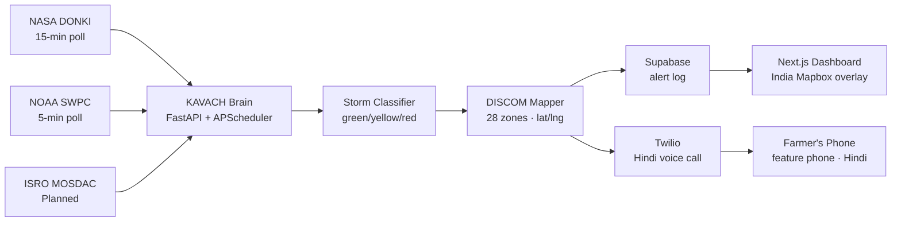

# KAVACH — Autonomous Space Weather Shield for India

> **"It called the farmer before the lights went out."**

[](https://fastapi.tiangolo.com)
[](https://nextjs.org)
[](https://twilio.com)
[](https://vercel.com)
[](LICENSE)

**FAR AWAY 2026 Hackathon** · Space & Aerospace · Team 404_SHINOBI

---

## The Problem

On May 10–11, 2024, the strongest geomagnetic storm in 20 years hit Earth (Kp=9.0, G5 level):

- India's 28 power grid utilities (DISCOMs) received **zero automated warning**
- 300 million farmers and fishermen relying on GPS got **no alert at all**
- English-only, internet-only Western alert systems are useless to India's last mile
- India came within hours of widespread transformer failures

**No Indian team had ever built a solution.** Until KAVACH.

---

## What KAVACH Does

When NASA/NOAA detects a solar storm heading toward Earth:

1. **Monitors** NASA DONKI + NOAA SWPC every 15 minutes, autonomously
2. **Maps** storm risk onto India's 28 DISCOM grid zones (north-first, by geomagnetic exposure)
3. **Calls** farmers and fishermen in **Hindi** on basic feature phones via Twilio — no app, no internet required

Zero human trigger. Fully autonomous.

---

## Live Demo

**Frontend:** https://frontend-rust-xi-79.vercel.app  
**Backend API:** https://powerful-respect-production-482e.up.railway.app  

Click **REPLAY STORM** to relive the May 2024 G5 event — map goes red, Hindi call fires, in under 90 seconds.

---

## Architecture



**Data flow:** raw solar event → severity classification → regional risk mapping → simultaneous DISCOM notification + farmer voice call.

---

## Features

| Feature | Description |
|---------|-------------|
| **Command Center** | Live India map · 28 DISCOM zones · Kp gauge · alert log |
| **Demo Replay** | 9-step SSE stream replaying May 2024 storm (22.6s) |
| **Call Recording Proof** | Every demo call auto-recorded · audio player appears in UI after call ends |
| **Aurora Predictor** | Kp-based Northern Lights visibility for 6 Indian locations · plotted on map |
| **Daily Shield** | Space Weather Score 0–100 · Devanagari Hindi + English morning briefing |
| **Storm Memory** | 4 historical storms · counterfactual KAVACH alerts since 2003 |
| **Solar Header** | Three.js Sun+Earth+CME particle system · storm-reactive |

---

## Tech Stack

| Layer | Technology |
|-------|-----------|
| Frontend | Next.js 14 · TypeScript · Tailwind · Mapbox GL JS · Three.js |
| Backend | FastAPI · APScheduler · httpx · Python 3.13 |
| Database | Supabase (PostgreSQL + realtime) |
| Voice | Twilio Programmable Voice · Amazon Polly Aditi (hi-IN) |
| Data | NASA DONKI API · NOAA SWPC API · ISRO (planned) |
| Deploy | Vercel (frontend) · Railway (backend) |

---

## Quick Start

### Prerequisites
- Python 3.11+
- Node.js 18+
- Twilio account with a phone number
- NASA API key (free at https://api.nasa.gov)
- Supabase project
- Mapbox token

### Backend
```bash
cd backend
pip install -r requirements.txt
cp ../.env.example ../.env
# Edit .env with your keys
uvicorn main:app --reload
```

### Frontend
```bash
cd frontend
npm install
# Copy .env.example to .env.local and fill in values
npm run dev
```

### Run the Demo
1. Start backend on port 8000
2. Start frontend on port 3000
3. Open http://localhost:3000
4. Click **REPLAY STORM**

---

## API Reference

| Method | Endpoint | Description |
|--------|----------|-------------|
| GET | `/health` | Health check |
| GET | `/storm/current` | Live Kp-index from NOAA |
| GET | `/storm/may2024` | May 2024 extreme storm dataset |
| GET | `/storm/history?days=7` | Recent storm history from NASA DONKI |
| GET | `/alerts/discoms` | All 28 DISCOMs with risk levels |
| POST | `/demo/replay` | SSE stream — replay May 2024 storm |
| POST | `/demo/trigger-call?phones=+91XXXXXXXXXX` | Fire Hindi Twilio call (comma-sep for multiple) |
| GET | `/demo/recording?call_sid=CAxxxx` | Check if recording ready, returns proxy URL |
| GET | `/demo/recording-audio?sid=RExxxx` | Stream Twilio MP3 through backend (no browser auth) |
| GET | `/aurora/predictions?kp=9.0` | Aurora visibility by location |
| GET | `/shield/score` | Current Space Weather Score (0–100) |
| GET | `/shield/daily-brief` | Full Hindi+English briefing |
| GET | `/memory/storms` | 4 historical storms with KAVACH counterfactuals |
| GET | `/memory/totals` | Aggregate stats across all storms |

---

## Environment Variables

```bash
# NASA
NASA_API_KEY=your_key_here

# NOAA (default set in code)
NOAA_KP_URL=https://services.swpc.noaa.gov/json/planetary_k_index_1m.json

# Twilio
TWILIO_ACCOUNT_SID=ACxxxxxxxxxxxxxxxxxxxxxxxxxxxxxxxx
TWILIO_AUTH_TOKEN=your_auth_token
TWILIO_PHONE_NUMBER=+1XXXXXXXXXX
DEMO_PHONE_NUMBER=+91XXXXXXXXXX,+91YYYYYYYYYY   # comma-separated for multiple simultaneous calls

# Supabase
SUPABASE_URL=https://your-project.supabase.co
SUPABASE_KEY=your_service_role_key

# Frontend (Vercel-served Hindi audio fallback)
KAVACH_AUDIO_URL=https://your-frontend.vercel.app/hindi_alert.mp3

# Frontend .env.local
NEXT_PUBLIC_BACKEND_URL=http://localhost:8000
NEXT_PUBLIC_MAPBOX_TOKEN=pk.eyJ1...
```

---

## Changing Demo Phone Numbers

KAVACH can call **multiple phones simultaneously** during the demo. Phone numbers live in `.env` as a comma-separated list:

```env
DEMO_PHONE_NUMBER=+919999999999,+918888888888,+917777777777
```

### Local backend (running `python main.py`)

The backend re-reads `.env` on **every call** — no restart needed. Just edit `.env` and fire the next demo.

### Railway backend (deployed)

Railway does not read your local `.env`. Use the sync script whenever you change numbers:

```powershell
# Sync only the phone number (fast, ~5 seconds)
powershell -File sync_railway.ps1 -PhoneOnly

# Sync all env vars (Twilio, NASA key, etc.)
powershell -File sync_railway.ps1
```

Railway auto-restarts after each sync. New numbers are live in ~10 seconds.

> **One-time setup:** run `railway link` once to connect the CLI to your project, then the script works from anywhere.

### Fire a call manually (no demo needed)

```
POST /demo/trigger-call?phones=+91XXXXXXXXXX,+91YYYYYYYYYY
```

---

## The Story Behind KAVACH

The May 2024 storm was the largest in 20 years. Auroras appeared over Hanle Observatory in Ladakh — the first time in decades. India's power grid survived by luck, not design. The GPS systems guiding farmers' precision agriculture tractors failed without warning.

KAVACH is India's answer. One system. 28 grid utilities. 300 million people. Hindi voice calls on feature phones. No app required.

> Across 4 major storms since 2003, KAVACH would have fired **847 alerts** — warning farmers an average of **6 hours before peak impact**.

---

## Revenue Model

| Tier | Price | Value |
|------|-------|-------|
| Public | Free | Citizens, farmers, fishermen |
| DISCOM API | ₹2–5L/month per utility | 4.5-hour advance warning |
| 5 DISCOMs | ₹1.8Cr/year ARR | Protects ₹3,000Cr in transformer assets |
| Future | Aviation · Telecom · Insurance APIs | Phase 2 expansion |

---

## Coming in Round 2

- **Multi-language expansion** — Tamil, Telugu, Marathi, Bengali, Punjabi, Gujarati, Kannada by DISCOM zone
- **ISRO VEDAS integration** — ionospheric scintillation data
- **WhatsApp/SMS alerts** — beyond voice calls
- **Two-Way Voice Reply** — farmer presses 1 to confirm, 2 for help — KAVACH escalates
- **DISCOM dashboard portal** — operator-facing SaaS

See `docs/future_features.md` for the full roadmap.

---

## Team

Built by **Team 404_SHINOBI** for FAR AWAY 2026. Concept to live deployment in 6 days.

---

## License

MIT — see [LICENSE](LICENSE)

---

*FAR AWAY 2026 · Submission deadline: June 14, 2026 · Team 404_SHINOBI*
